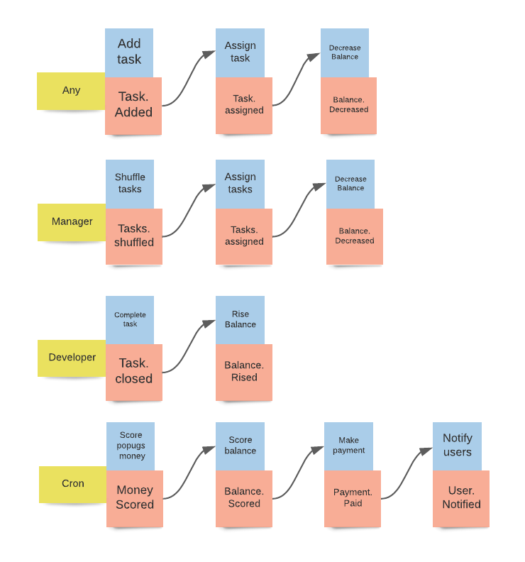
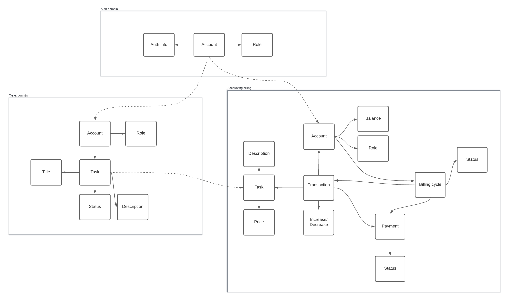
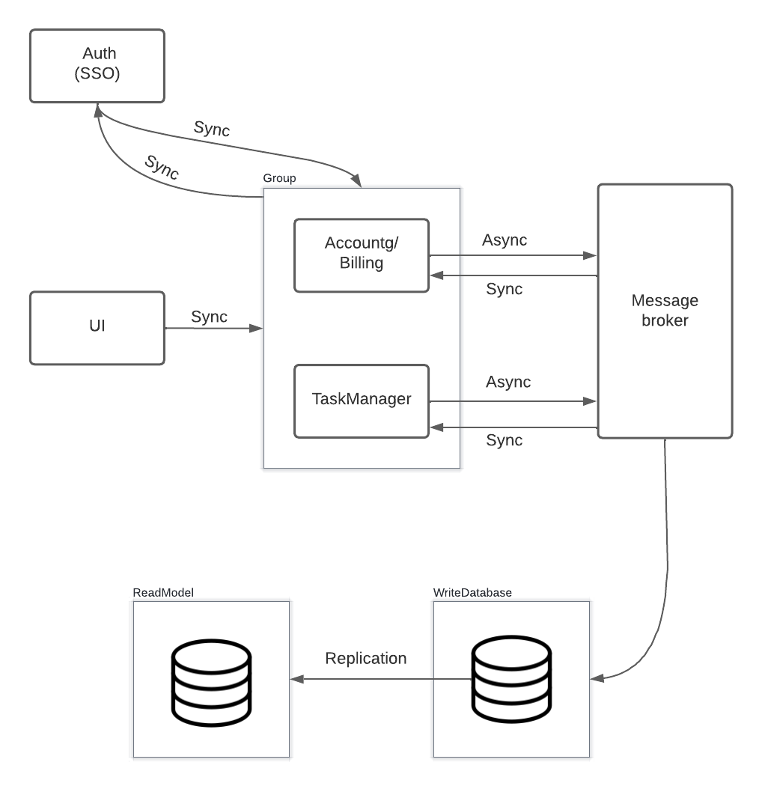

# Awesome-Task-Exchange-System-aTES

## Description
Task tracker for parrots.

## Project's events.

## Data modeling and domains.

## Architecture scheme

## TODO:
- Make more complete desctiption about project
